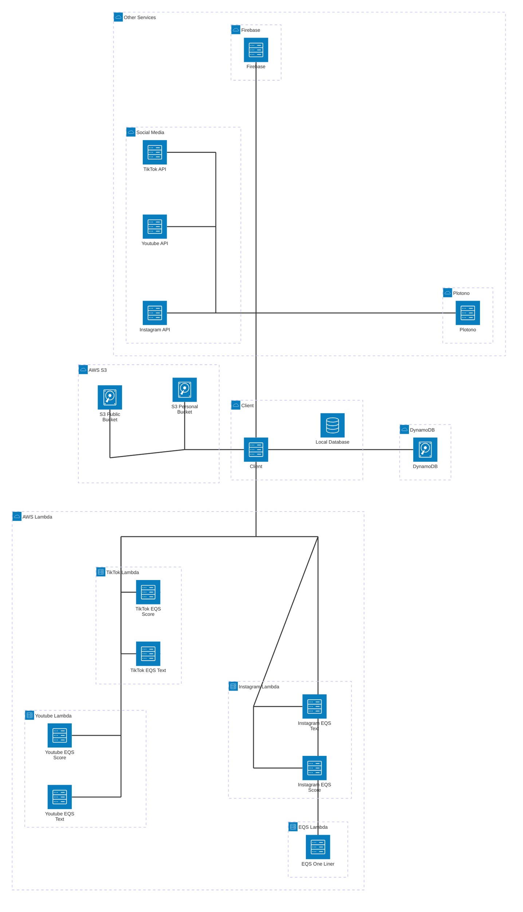

# Architecture Overview

Brief overview of Architectural decisions involving Flashkit,

## Major Features
- 2 databases for faster load times, local and DynamoDB.
- 2 storage solutions, local and S3.
- real time data sync across multiple devices, single source of truth- dynamoDB.
- real time user data fetching, manipulations and transformations.
- canvas link sharing and previewing, editable links and non editable links.
- inbuilt canvas for creating designs.
- real time cloud saving and loading of designs.
- inbuilt EQS score for social media.
- inbuilt analytics for social media.
- processing tens of thousands of data points on client side.
- inbuilt file system for storing designs locally.
- when offline, eventually the changes are synced to the cloud.
- inbuilt worker service for syncing data between local and dynamoDB.
- multiple canvas features.

## Dual Database Architecture
- Flashkit uses a dual database architecture, with a local database for fast access and a DynamoDB for cloud storage and syncing.
- The local database is used for storing user data and design files, while the DynamoDB is used for storing user data and design files in the cloud.
- Onload of the app, changes made to local database while offline are synced to the DynamoDB, and vice versa.
- in cases of conflict, DynamoDB is the source of truth.
- The local database is used for fast access to user data and design files, while the DynamoDB is used for cloud storage and syncing.
- Both databases are synced in real time, and changes made to one database are reflected in the other database.

## AWS Services
- [AWS Lambda](https://aws.amazon.com/lambda/): Serverless compute service that runs your code in response to events and automatically manages the underlying compute resources for you. Used for processing data and getting AI responses.
- [AWS S3](https://aws.amazon.com/s3/): Object storage service that offers industry-leading scalability, data availability, security, and performance. Used for storing design files and images.
- [AWS DynamoDB](https://aws.amazon.com/dynamodb/): Fully managed NoSQL database service that provides fast and predictable performance with seamless scalability. Used for storing user data and design files.

